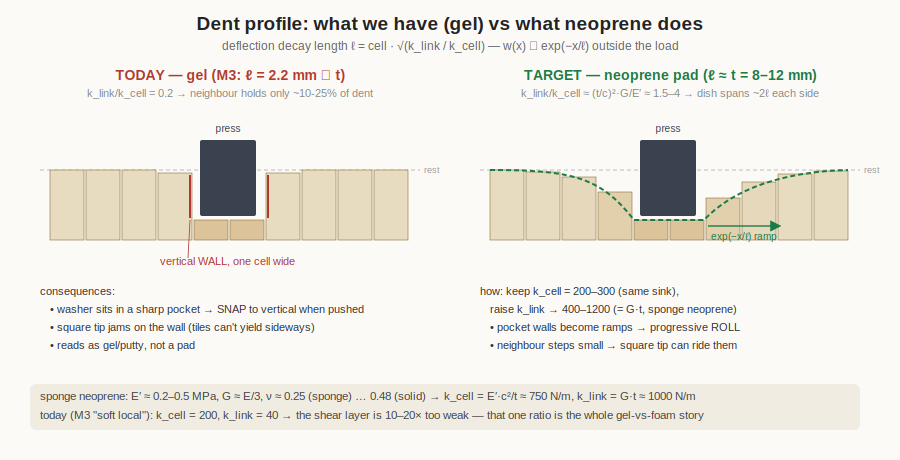
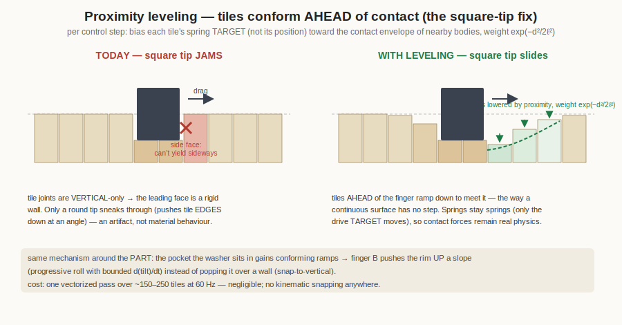
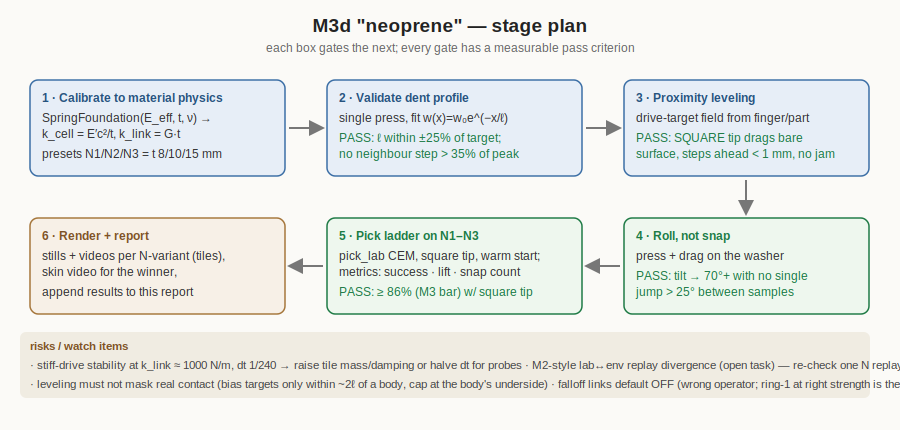

# Soft-surface materials report — 2026-07-04

*Compliant work-surface for the washer press→drag→roll-up pick. What the model
is, what we measured across four material variants, why the current material
behaves like a **gel** rather than a **foam/neoprene pad**, and the calculations
for the neoprene-like next iteration.*

All image/video links are relative to this file (open via the file browser at
`this data/reports/ folder`).

---

## 1. The model — underlying logic

The surface is a grid of small rigid **tile columns** (`graspsort/soft_foundation.py`).
Each tile has three ingredients, all integrated by PhysX (no per-step scripting):

| ingredient | implementation | physical meaning |
|---|---|---|
| **vertical spring** | prismatic joint to world, linear drive: stiffness `k_cell`, damping `c` | a column of the pad compressing: `k_cell ≈ E′·cell²/t` (E′ = effective compression modulus, t = pad thickness) |
| **shear coupling** | D6 joint per neighbour pair, Z-drive pulling heights equal: stiffness `k_link` | the Pasternak shear layer: `k_link ≈ G·t` (G = shear modulus). Note `G·t` is **independent of cell size** |
| **drop-off** (optional) | extra links to neighbours-of-neighbours at `k_link·falloff^(r−1)`, truncated below `cutoff` | non-local smoothing (ad-hoc; see §4 — the proper operator is the ring-1 Laplacian at the *right strength*) |

This is a discrete **Winkler–Pasternak foundation**. Its single most important
emergent property is the **characteristic decay length** of a dent:

```
ℓ = cell · √(k_link / k_cell)
```

Outside a loaded region the deflection falls off as `w(x) ∝ exp(−x/ℓ)`.
**ℓ is what your eye reads as "foam vs gel".** A real elastic pad spreads its
dent over roughly its own thickness (ℓ ≈ t); a gel/putty localises (ℓ → 0).

The smooth **skin** (`SurfaceSkin`) is purely cosmetic: a non-colliding
Catmull-Clark mesh re-draped over the tile tops each rendered frame.

## 2. What we measured

### 2.1 Coupling exists and works (2026-07-03)

One-sided 3 mm press on an M12 washer, centre-row deflection (mm), 4 mm cells:

```
couple = 0    (pure Winkler):  .2 .2 .2 .2 | 3.0 3.0 3.0 3.0 | .2 .2 .2   → hard dimple, washer FLIPS to 89°
couple = 150  (Pasternak):     .2 .3 .7 4.2 6.0 5.0 4.4 4.1 3.8 3.3 .9 .3 → dish, washer settles ~8°
```


*(left-to-right: the couple=150 dish under finger+washer — but note the edge
of the dish still drops from 3.3 mm to 0.9 mm in ONE cell: a wall, not a slope)*

### 2.2 The FIRST pick ladder (M3c, morning — capsule tip, no leveling; superseded by §6)

*Historical baseline:* the two-finger press→drag→roll-up pick learned by CEM
per material (`tools/pick_lab.py`, 8 rigs × 8 rounds, 64 evals each; replays in
`tools/render_pick.py`). These runs used the **capsule-tip workaround and no
proximity leveling** — the latest results (square tip + leveling + calibrated
neoprene) are in **§6**. Full data: `../2026-07-04/lab_mats2/`.

| material | k_cell | k_link | falloff | **ℓ (mm)** | success | best lift | assets |
|---|---|---|---|---|---|---|---|
| M0 as-is | 300 | 150 | 0 | **3.5** | 59 % | 64.9 mm | [engaged](../2026-07-04/render_M0_asis/p2_engaged_zoom.png) · [lifted](../2026-07-04/render_M0_asis/p3_lifted_zoom.png) · [video](../2026-07-04/render_M0_asis/pick.mp4) |
| M1 drop-off | 300 | 150 | 0.5 | ~4.5 | 56 % | 59.0 mm | [lifted](../2026-07-04/render_M1_dropoff/p3_lifted_zoom.png) · [video](../2026-07-04/render_M1_dropoff/pick.mp4) |
| M2 firm+local | 600 | 80 | 0.4 | **1.8** | 42 % | 54.4 mm | [video](../2026-07-04/render_M2_firm_local/pick.mp4) *(replay brittle in full env — open task)* |
| M3 soft+local | 200 | 40 | 0.3 | **2.2** | **86 %** | 34.9 mm | [lifted](../2026-07-04/render_M3_soft_local/p3_lifted_zoom.png) · [video](../2026-07-04/render_M3_soft_local/pick.mp4) · [skin video](../2026-07-04/render_M3_skin/pick.mp4) |


Maneuver findings baked into the lab along the way: the pinch gap must close
*below* washer thickness (the compliant finger-B spring turns overlap into a
bounded grip force), and the close must happen **at depth before the lift**
(else the rolled-up washer is left standing in the foam at +11.7 mm = OD/2 − sink).

## 3. Diagnosis — it's a gel, not a foam

Every observation from review traces to **ℓ being ~2–4 mm when a neoprene-like
pad of this thickness should have ℓ ≈ 8–12 mm** (k_link 10–20× too weak):

1. **"Steep cliff under the press, minor influence around it."**
   Correct: at ℓ = 2–3.5 mm the first unloaded neighbour sits at
   `exp(−cell/ℓ)` ≈ 10–25 % of the pressed depth → a near-vertical wall one
   cell wide. Gel/putty response.
2. **"Part snaps to vertical when finger B arrives."**
   The washer's rim rests inside a sharp-walled pocket. B's push must first
   overcome the wall; once the rim passes the lip, the stored spring energy
   releases at once → snap instead of a progressive roll. A long-ℓ dish has
   ramped walls → the rim rides up gradually.
3. **"Capsule tip needed; square tip should work."**
   Correct diagnosis: the tiles are *laterally rigid* (their joints only allow
   vertical travel), so a square tip dragging with its bottom below tile-top
   level pushes on a vertical tile face that physically cannot yield sideways —
   it jams. The capsule only works because its round bottom converts drag into
   downward push on tile *edges*. This is a discretisation artifact, not physics.

## 4. What neoprene should do — the numbers

Material data (see sources): solid neoprene **E ≈ 2–5 MPa, ν ≈ 0.48**;
neoprene *sponge* (pad material) is ~10× softer — measured soft-rubber values
**E ≈ 0.46 MPa, G ≈ 0.15 MPa (ν ≈ 0.5)**; open/closed-cell foams run ν ≈ 0–0.3.

For a pad of thickness **t = 10 mm**, cells **c = 5 mm**, sponge-neoprene
E′ ≈ 0.2–0.5 MPa, G ≈ E/3:

```
k_cell = E′·c²/t   =  0.3e6 × 2.5e-5 / 0.01  ≈  750 N/m    (we run 200–300: slightly softer pad — fine)
k_link = G·t       =  0.1e6 × 0.01           ≈  1000 N/m   (we run 40–150: 10–20× TOO WEAK ← the bug)
ratio  = k_link/k_cell ≈ (t/c)²·(G/E′) ≈ (t/c)²/3 ≈ 1.3–4
ℓ      = c·√(ratio) ≈ 6–10 mm ≈ t             (foam/neoprene: dent spreads ≈ pad thickness)
```

**Target: `k_link ≈ 1.5–4 × k_cell`** (today: 0.2×). Because the deflection
*shape* depends only on the ratio, we can keep k_cell at the validated 200–300
and raise k_link to ~400–1200 — the sink depth stays familiar, the dish widens.

Additional corrections to match a continuous pad:

- **Drop the falloff long-range links.** The proper shear layer is the ring-1
  Laplacian at the right strength; the falloff links implement a different,
  ad-hoc non-local operator (and empirically cost success: M1 56 % < M0 59 %).
  Keep `falloff` for experiments; default it off.
- **Proximity leveling (the square-tip fix).** Tiles do not know an object is
  *approaching* — a continuous surface does, because its slope is bounded. Per
  control step (60 Hz), bias each tile's **drive target** (not its position —
  springs stay springs) toward the local contact envelope of nearby bodies
  (finger footprints, part underside), weighted `exp(−d²/2ℓ²)`. Tiles ahead of
  a dragging finger ramp down to meet it → no wall → **square tip works**, and
  the pocket around the washer gains real ramps → smoother roll, no snap.
- **Stability watch:** k_link ≈ 1000 N/m × 8 links on a 6 g tile is a stiff
  system at dt = 1/240. If drives ring: raise tile mass (~20 g), raise damping
  (c ≈ 2√(k·m)·0.5), or halve dt for the calibration probes only.
- *(Deliberately ignored for now: incompressible-rubber bulging — material
  displaced under the indenter re-appearing as a raised ring. Add later as a
  small negative ring-2 term if realism review calls for it.)*

## 5. Next stage (M3d "neoprene") — plan







1. **Calibrate** — expose `E_eff, t, ν` on `SpringFoundation` and derive
   `k_cell, k_link, ℓ` (raw overrides stay). Neoprene presets N1 (t=8), N2 (t=10), N3 (t=15 mm).
2. **Validate the profile** — single-press probe; fit measured centre-row
   deflection to `exp(−x/ℓ)`; pass = fitted ℓ within ±25 % of target and no
   one-cell cliffs (max step between neighbours < 35 % of peak).
3. **Proximity leveling** — implement drive-target field; verify a **square
   tip** drags across the bare surface without jamming (spring force stays
   below half the old jam force) and that tile steps ahead of the tip stay < 1 mm.
4. **Roll quality** — press+drag on the washer; pass = tilt climbs to 70°+ with
   `d(tilt)/dt` bounded (no single-step jump > 25°) → "roll, not snap".
5. **Re-run the pick ladder** on N1–N3 with the square tip; compare success,
   lift, and snap metric vs M0/M3. Keep CEM warm start.
6. **Render** — stills + videos per N-variant (tiles view), skin video for the
   best; append results section here.

Success for the stage: ≥ M3's 86 % **with a square tip and no snap**, on a
material whose measured ℓ ≈ pad thickness — i.e. the pick works *because* the
material is right, not despite it.

---

## 6. M3d results (same day, evening)

Everything in §5 steps 1–5 was implemented and run
(`data/2026-07-04/{profile2,profile3,lab_neo,lab_neo2}`).

**Profile calibration.** The bar-load probe found a constant **solver
correction α ≈ 4**: PhysX TGS under-enforces stiff drive chains, so the dish
comes out ~2× narrower than the Pasternak prediction (unchanged by solver
iteration bumps). `neoprene()` therefore configures `couple = 4·G·t`. Measured
ramps at k_cell = 250: ratio 6 → neighbour 44 % of peak; **ratio 10 → 52 / 35 /
16 % over three tiles — the fig/01 target shape.** (The gel: 13 %.)


**Proximity leveling works.** With `level_targets()` + a **square tip**, every
material in the ladder picks — including the old gel (its v1 square-tip drags
jammed outright). The leveling is what makes square-tip contact possible; the
coupling ratio is what shapes the dish.

**Pick ladder (8 rigs × 8 rounds each, square tip, leveling on):**

| material | success | arrival-snap among successes | best lift |
|---|---|---|---|
| NEO_R6 (ratio 6) | 48 % | 31/31 (~52°/sample) | 32.0 mm |
| NEO_R10 (ratio 10) | 44 % | 28/28 (~54°/sample) | 36.3 mm |
| gel + leveling (control) | 61 % | 31/39 — **2 clean rolls found (23°/sample)** | 40.7 mm |

**The honest headline: realism costs ease, and the snap moved, it didn't die.**
On the realistic dish a one-sided press mostly pushes the washer *down* (the
neighbourhood follows — that's the material being right). CEM's winning
neoprene strategy became a **rim-press pop**: press the washer's extreme edge
(a_off → 11.4–11.7 mm of a 12 mm radius), the washer squirts upward like a
squeezed watermelon seed, catch it between the fingers. Effective — but the
fast tilt jump is now a *policy exploit of rigid-washer dynamics*, no longer
the pocket-wall artifact of §3. The old gel, ironically, is what allowed
slow 23°/sample rolls, because its sharp pocket holds the washer's near edge
while the far edge climbs.

**Fork for the next phase** (needs a design call):
1. **Accept the pop-catch** as the realistic technique on neoprene (humans do
   flip washers off mousepads exactly this way) and optimise for *catch
   reliability* instead of penalising the fast tilt; or
2. **Chase the gentle roll on neoprene** with a richer primitive — slower
   force-limited press ramps, or finger B pressing down on the rising side as
   a brake while A keeps pressing (a two-contact roll, closer to the original
   SVG intent than the current open-loop waypoints).

### The NEO_R10 pick, rendered (replays the lab exactly: success, 37.1 mm lift)

Pressed — note the **wide smooth dish** across the tile field (the calibrated
neoprene response; compare the one-cell pocket in §2.1):


Engaged — the washer rolled up against the **square** blue finger:


Lifted clear:


Full maneuver videos (~9 s each):
[tiles view](../2026-07-04/render_NEO_R10/pick.mp4) ·
[foam-skin view](../2026-07-04/render_NEO_R10_skin/pick.mp4)

*(The gel "clean roll" candidate — 23°/sample in-lab — did NOT reproduce when
replayed in the full env (`render_gel_cleanroll/`): washer left at rest.
Fragile, like the M2 replays — marginal gel-material behaviours don't
transfer between contexts; another point for doing realism properly.)*

---

## 7. M3e — the parallel gripper picks GENTLY (late evening)

David's redesign resolved the §6 fork in favour of the gentle roll — with a
different *primitive*, not a different material: bind both fingers into ONE
gripper (they descend together, A ~50 % over the rim touches first), use B's
spring deflection as the **touch sensor**, then *pull up and together*. Success
redefined: the washer must clear the **press-down height** (hang free of the
dish), not the original surface.

What the iterations taught (each diagnosed from a failed smoke/CEM run):
close-while-rising **bulldozes** the part sideways; closing fully at depth
**irons it flat**; pressing harder mostly **sinks** (1.2 of 1.8 mm — the pad
being realistic); the roll comes from **B rising with the edge held by
friction**, so the winning knob is a power-law close that lags the rise and
completes at the end (`close_pow ≈ 1.9`).

**Ladder v2 (8 rigs × 10 rounds each, square tip, leveling, gentle press ≤ 4.8 mm):**

| material | success | gentle successes (dtilt < 25°/sample) | best clearance |
|---|---|---|---|
| SOFT220 (k 220, ratio 8) | **46 %** (6/8 final round) | **7**, best dtilt **7°** | 6.0 mm |
| MED250 (k 250, ratio 8) | 25 % | 6 | 5.6 mm |

**The gentle pick exists on the realistic material**: 13 runs rolled the washer
smoothly (6–13°/sample — compare ~52° for the M3d pop-catch), captured it
between the fingers, and lifted it clear of the pressed dish. θ converged to
a_over ≈ 0.6 (slightly more than half over the rim), press ≈ 4 mm, gap ≈ 2.8 mm,
rise ≈ 12–14 mm.

Two caveats, honestly measured:

1. **The touch trigger under-fires** (3–16 of 160 evals; the gentle edge-rise
   only brushes B) — successful grips ride the wait-timeout path. On hardware
   this is a force-sensor threshold to tune; in the sim the fixed beat works.
2. **Lab→env transfer holds for CAPTURE, not yet for full clearance.** The
   SOFT220 best replays in the full env as a genuine captured pick (washer
   pinched between the fingers, carried up with the gripper) but retains only
   ~1.3–1.9 mm of clearance and slips to ~59–89° during the rise; the marginal
   gentle candidates don't replay at all (same brittleness family as the M2
   and gel-cleanroll replays). Next step: **robustness-aware selection** —
   score elites under jitter (seed, ±0.5 mm placement, surface-height offset)
   in-lab before declaring a winner, instead of trusting single-run rewards.

### The parallel-gripper pick in the full env (captured demo)

Engaged — the bound gripper has descended as one unit, A pressing ~60 % over
the rim, the washer rolled between the fingers in the soft dish:


Lifted — washer pinched between the fingertips, carried clear of the bed:


[tiles video](../2026-07-04/render_grip_hero2/pick.mp4) ·
[skin video](../2026-07-04/render_grip_hero2_skin/pick.mp4)

---

### Sources

- [Neoprene material properties (E ≈ 2–5 MPa, ν ≈ 0.48)](https://blog.truegeometry.com/designs3D/Neoprene_Rubber20240329.html)
- [Elastic properties of polychloroprene (neoprene) rubbers — E ≈ 460 kPa, G ≈ 148 kPa soft compounds](https://www.ncbi.nlm.nih.gov/pmc/articles/PMC7602244/)
- [Poisson's ratio of hyperelastic foams ≈ 0 in compression](https://www.osti.gov/pages/servlets/purl/1457403)
- [Winkler, Pasternak and Kerr foundation models](https://revue.ummto.dz/index.php/JMES/article/download/3844/pdf)
- [Pasternak model for surface displacement of a finite elastic layer](https://www.researchgate.net/publication/245440933_Pasternak_Model_Formulation_of_Elastic_Displacements_in_the_Case_of_a_Rigid_Circular_Foundation)

### Data & code index

- Model: `graspsort/soft_foundation.py` (SpringFoundation + SurfaceSkin)
- Lab: `tools/pick_lab.py` · replay/render: `tools/render_pick.py`
- Ladder data: `../2026-07-04/lab_mats2/` (evals.jsonl, results.json, learning_curves.png)
- Renders: `../2026-07-04/render_{M0_asis,M1_dropoff,M2_firm_local,M3_soft_local,M3_skin}/`
- Earlier dish/tilt validation: `../2026-07-03/{couple_0,couple_150,rf9,skin1}/`
